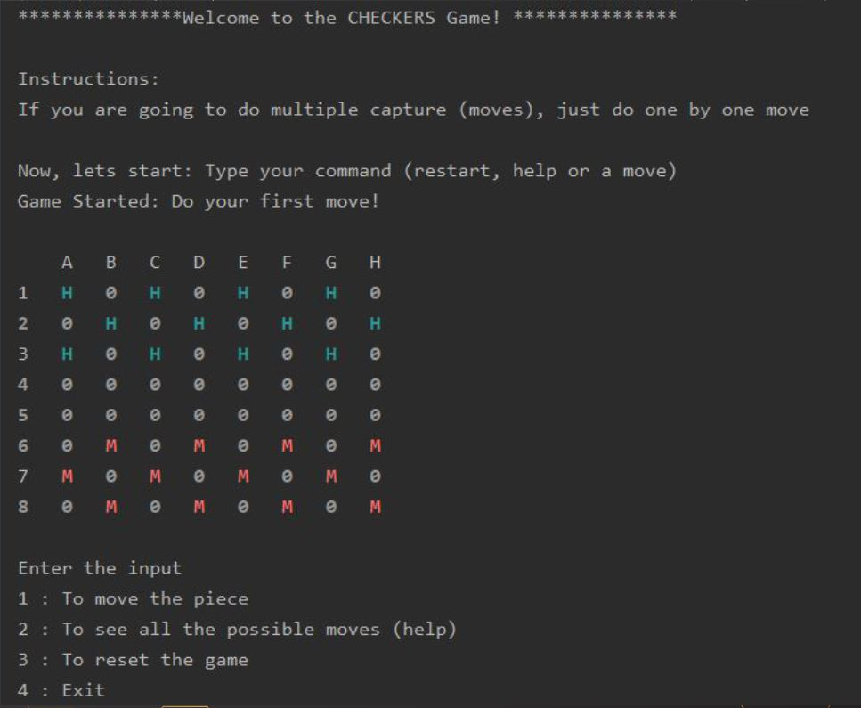

# Checkers
This is project developed in Scala for the discipline [Functional Programming with Scala](https://github.com/kydos/2019-ESIEE-DSIA-5101C) at ESIEE PARIS for the 2nd year Msc students in Computer Engineering. 

This project aimed at providing the students with the opportunity to apply functional programming concepts learned in the course. The project was developed from the scratch. A demo image can be found below:

